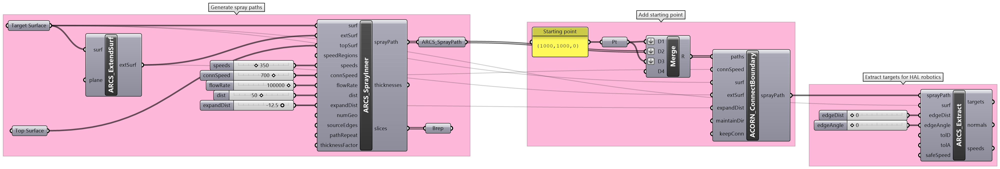
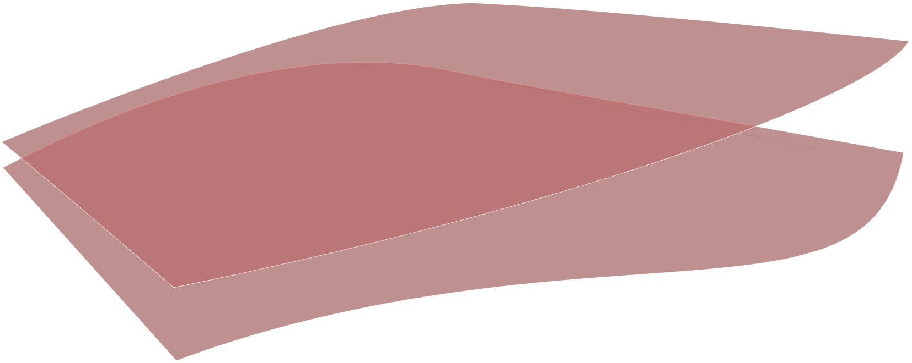
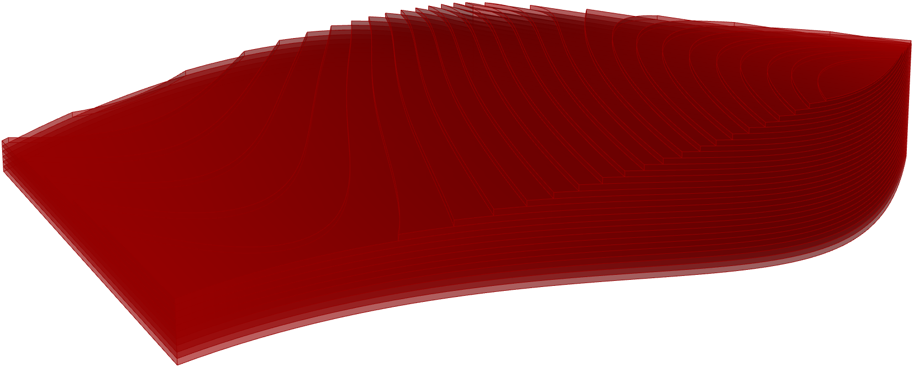
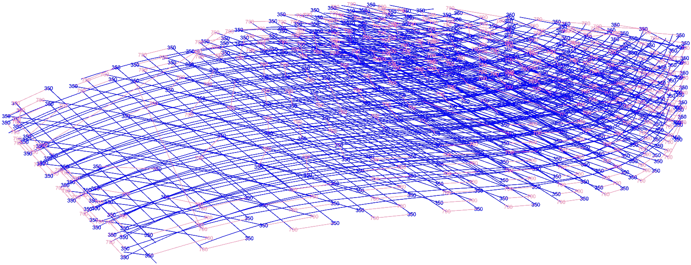

# Automated Robotic Concrete Spraying (ARCS)
This package allows users to generate concrete spraying paths for use in robotic concrete spraying.

## Dependencies
* HAL Robotics (*optional* – for post path generation. All components and the module works without the plug-in.)

## Installation
Compile using Visual Studio 2019 or later and install the GHA file found in `bin\ARCS.gha`.

## Example
Example Grasshopper definition is included in `examples\example.gh`.

| Surfaces | Slices | Paths |
| :--: | :--: | :--: |
|   |   |  |

## Contact
Mishael Nuh - men30@cam.ac.uk